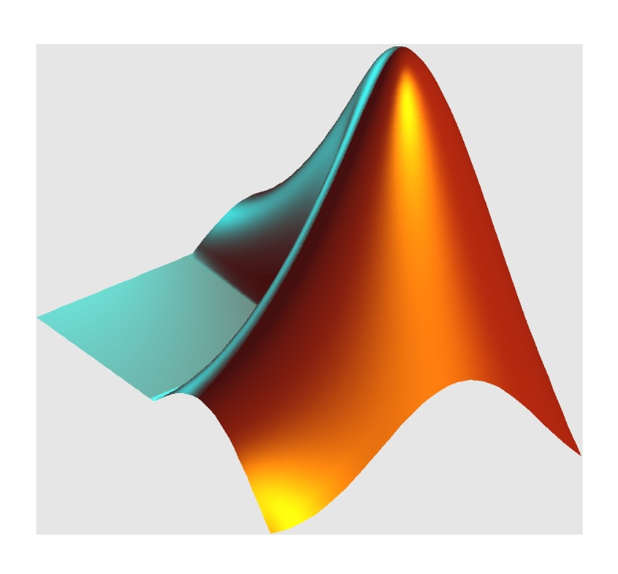

<h1 align="center">Hi 👋, I'm Amit Singh</h1>
<h3 align="center">Innovative, task-driven professional with a strong understanding of full stack development</h3>

  

- 👨‍💻 All of my projects are available at [https://amit-singh-05.github.io/](https://amit-singh-05.github.io/)

- 📫 How to reach me **ami9sin05@gmail.com**

- 📄 Know about my experiences [https://amit-singh-05.github.io/doc/Amit%20singh%20Resume.pdf](https://amit-singh-05.github.io/doc/Amit%20singh%20Resume.pdf)

<h3 align="left">Connect with me:</h3>

<h3 align="left">Languages and Tools:</h3>

 
     
    
     
     
     
     
    
     
    
     
     

    
    
    

